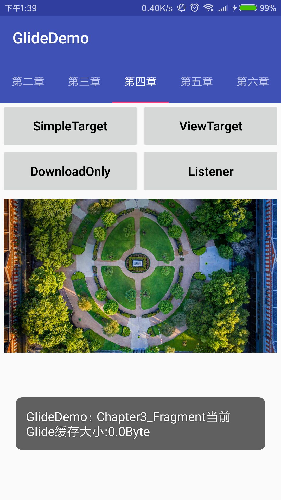
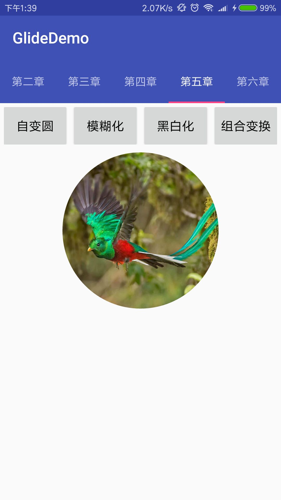
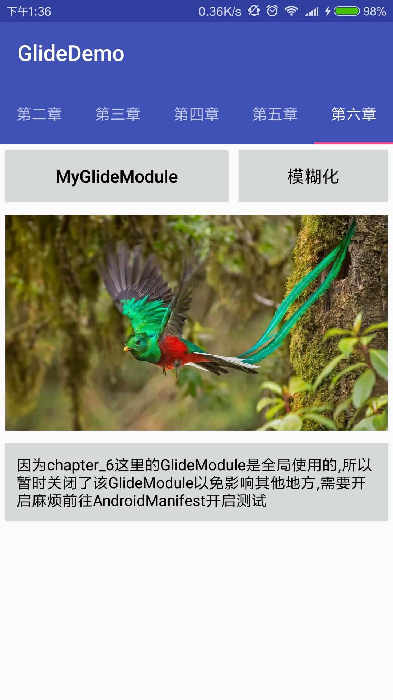

# GlideDemo
本项目主要以郭霖先生的 [Android图片加载框架最全解析（一），Glide的基本用法 - CSDN博客 ](https://blog.csdn.net/guolin_blog/article/details/53759439?utm_source=tuicool&utm_medium=referral)
这一系列的 Glide 文章为基础的Demo
* 辅助文章:[Glide4.0使用浅解 - 简书 ](https://www.jianshu.com/p/ab97d6bda8ec)
* 辅助源码文章:[【两篇就懂系列】Glide源码分析之加载图片流程(1/2) - 简书 ](https://www.jianshu.com/p/3bb4977ceb83)
* 辅助源码文章:[深入理解Glide | Jiantao ](https://yangjiantao.github.io/2017/10/25/%E6%B7%B1%E5%85%A5%E7%90%86%E8%A7%A3Glide/#more)

## 项目亮点
* 玩转开源库 Glide
* 学一点架构封装
* 简单爬取必应图片

### 项目截图

App体验地址：

如果你还没有熟悉RxJava的用法,请看这里:[simplebam/RxJavaDemo 本教程基于 RxJava2 实践练习Demo ](https://github.com/simplebam/RxJavaDemo)

### 推荐-推荐的不仅仅是技术
* [simplebam/RxJavaDemo 本教程基于 RxJava2 实践练习Demo ](https://github.com/simplebam/RxJavaDemo)
* [Google推荐的图片加载库Glide介绍 - 泡在网上的日子 ](http://www.jcodecraeer.com/a/anzhuokaifa/androidkaifa/2015/0327/2650.html)
* [Java获取必应每日一图教程 - CSDN博客 ](https://blog.csdn.net/simplebam/article/details/72819547)

项目不在多,在于你自己对知识点的领悟

 

### Support
如果你喜欢这个repository，请我喝杯咖啡，我会让它更完美~  

